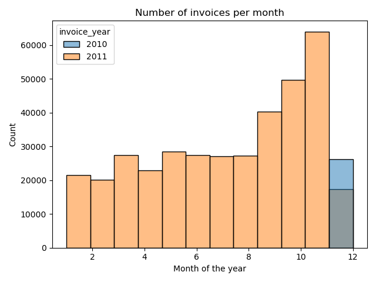
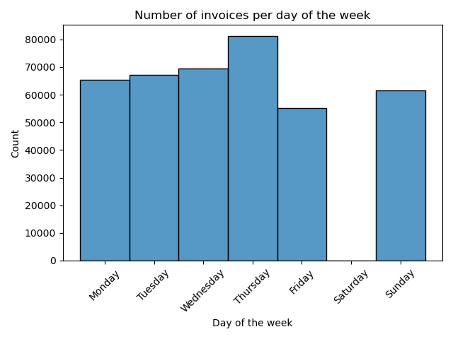
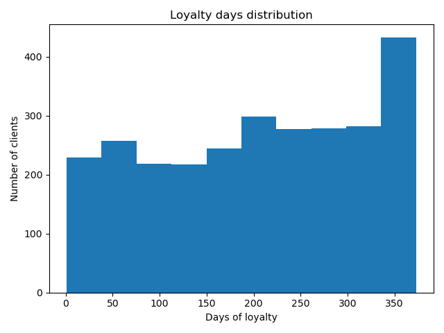

# Customer segmentation

Once built the ETL pipeline that clean the e-commerce data ([check repo here](https://github.com/adriannaluz/data-engineering_portfolio/tree/main/ETL_pipeline)), the analysis
of such data is going to be performance on this project. The aim is to segment the customer 
data.

## Data Exploration
In the data exploration notebook ([here](https://github.com/adriannaluz/data-analysis_portfolio/blob/customer_segmentation/customer_segmentation/notebooks/data_exploration.ipynb)), I had a rough look on the data to check for inconsistencies overseen during the data engineering. As a general overview, I found that:
- There almost 400K transactions with no null values
- The transactions were purchased in 37 different countries from December 2010 to December 2011
- There are 34 transactions with price equal to zero
- There are 8507 transactions with quantity smaller than zero. These transactions were considered returns 
- There are 18 stock codes with 'Unknown' descriptions. The reason why is still unclear

> [!NOTE]
> I decided to do a separated analysis on the returned transactions and the ones with price equal than zero. Therefore, the conclusions below will refer to a new dataset created by extracting the negative quantity data and the price equal to zero data.

- A total of 4334 customers were purchasing more than 18K invoices with around 3600 different products
- United Kingdom is the country with the highest number of purchases and Saudi Arabia with the lowest
- - The best seller item in the whole dataset is also the most return one

### Sales related findings

<table>
<tr><th> Top 5 best seller countries </th><th> Top 5 highest purchase </th></tr>
<tr><td>

|                      |  #invoices   |
|:--------------------:|:------------:|
|    United Kingdom    |    348 K     |
|       Germany        |     9 K      |
|        France        |     8 K      |
|         EIRE         |     7 K      |
|        Spain         |     2 K      |

</td><td>

|                      | total order value (pounds) |
|:--------------------:|:--------------------------:|
|    United Kingdom    |           6.81 M           |
|       Germany        |           0.28 M           |
|        France        |           0.25 M           |
|         EIRE         |           0.20 M           |
|        Spain         |           0.18 M           |
</td></tr> </table>

|    Top 5 best seller products     | Amount | Price | # countries sold |
|:---------------------------------:|:------:|:-----:|:----------------:|
|    PAPER CRAFT, LITTLE BIRDIE     | 80995  | 2.08  |        1         |
|  MEDIUM CERAMIC TOP STORAGE JAR   | 77916  | 1.25  |        10        |
| WORLD WAR 2 GLIDERS ASSTD DESIGNS | 54319  | 0.29  |        12        |
|          POPCORN HOLDER           | 49160  | 0.85  |        14        |
|      JUMBO BAG RED RETROSPOT      | 46078  | 1.95  |        20        |
### Analysing the retuned data, I did found:
- Some of the best seller products are also on the top of the most returned products. For that reason, the data will be analyze all together on the exploratory data analysis.
- There are 1534 customers who have returned a product at least once. That can be use on the future for the customer segmentation 
- 1916 products have been returned at least once

## Exploratory Data Analysis
For the exploratory data analysis, I used the complete dataset with the following modifications:
- 34 transactions (~0.01 % of the total data) with price equal to zero were ruled out

In contrast to the data exploration face, a more thorough analysis was performed in the exploratory data analysis. In this face I found that:  
- The price variable is positively skewed. The outliers represent 8.75 % of the data (based on the IQR method).
#- As a consequence, the total_order_value (price * quantity) will have also outliers which can alter the customer segmentation using k-means. 
- Purchases remained steady from January to August, then increased until November, reaching the highest peak. However, they sharply declined in December, with December 2011 having the fewest purchases 
- Customers are more likely to spend money on Thursdays. It is interesting that there is no data available for Saturdays 
- The customer loyalty was defined as the difference on time between the first invoice and the last invoice per client. Taking into account this new variable, I found that: 
  - The average loyalty time of a customer is 128 days
  - The mininmum and maximum loyalty time is 0 and 373 days respectively
  - 37% of the customers are customers only once (loyalty time equal to 0)
  - The distribution of the loyalty days (for customer with more than 1 loyalty day) is quite flat till around 350 days where there is an increasement of almost 200 customers 
